# LedgerLoop Architecture Diagrams

Visual diagrams of the LedgerLoop system architecture using Mermaid syntax.

---

## Table of Contents
1. [System Context Diagram](#1-system-context-diagram)
2. [Data Flow Diagrams](#2-data-flow-diagrams)
3. [Entity Relationship Diagram](#3-entity-relationship-diagram)
4. [Sequence Diagrams](#4-sequence-diagrams)
5. [Component Diagram](#5-component-diagram)
6. [State Diagrams](#6-state-diagrams)

---

## 1. System Context Diagram

Shows LedgerLoop's boundaries and external interactions.

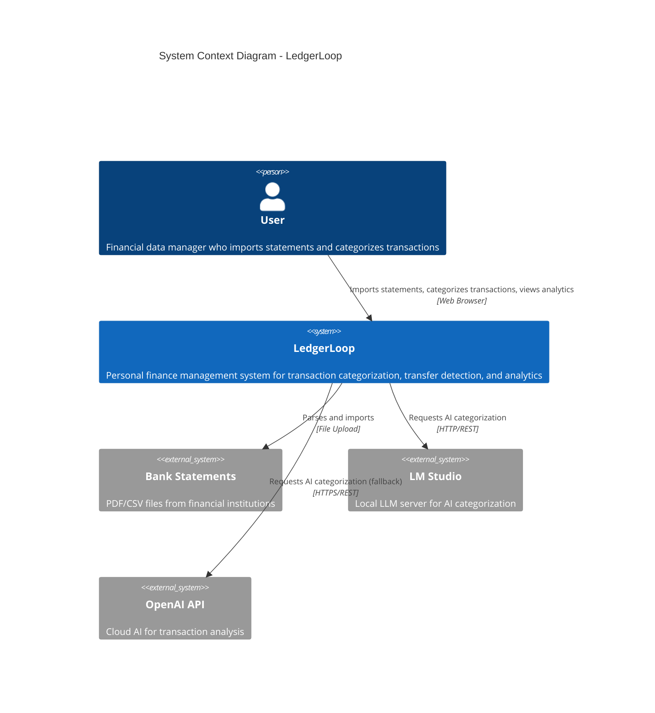
```mermaid
C4Context
    title System Context Diagram - LedgerLoop

    Person(user, "User", "Financial data manager who imports statements and categorizes transactions")

    System(ledgerloop, "LedgerLoop", "Personal finance management system for transaction categorization, transfer detection, and analytics")

    System_Ext(bank_pdf, "Bank Statements", "PDF/CSV files from financial institutions")
    System_Ext(lmstudio, "LM Studio", "Local LLM server for AI categorization")
    System_Ext(openai, "OpenAI API", "Cloud AI for transaction analysis")

    Rel(user, ledgerloop, "Imports statements, categorizes transactions, views analytics", "Web Browser")
    Rel(ledgerloop, bank_pdf, "Parses and imports", "File Upload")
    Rel(ledgerloop, lmstudio, "Requests AI categorization", "HTTP/REST")
    Rel(ledgerloop, openai, "Requests AI categorization (fallback)", "HTTPS/REST")
```

### Simplified Version (Standard Flowchart)

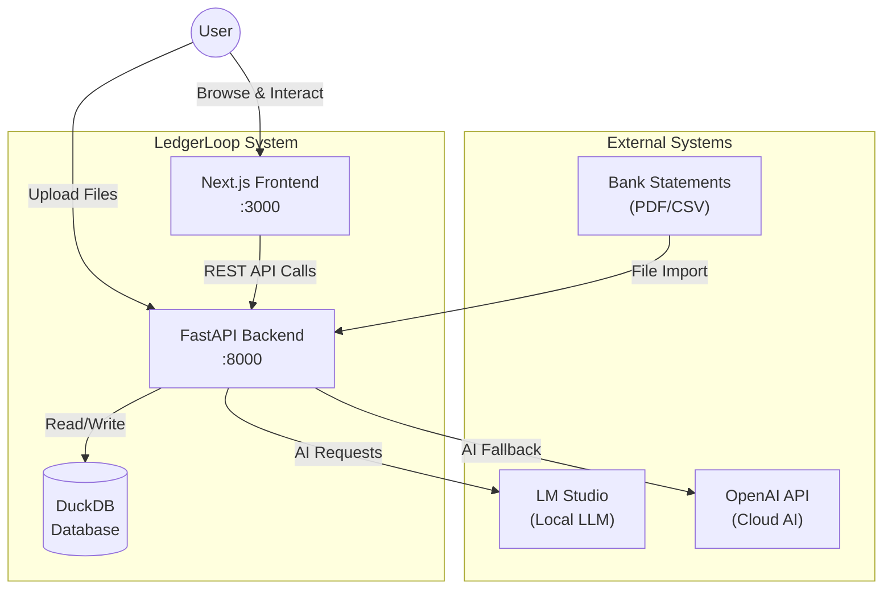
```mermaid
flowchart TB
    subgraph External["External Systems"]
        BANK["Bank Statements<br/>(PDF/CSV)"]
        LMS["LM Studio<br/>(Local LLM)"]
        OAI["OpenAI API<br/>(Cloud AI)"]
    end

    subgraph LedgerLoop["LedgerLoop System"]
        direction TB
        WEB["Next.js Frontend<br/>:3000"]
        API["FastAPI Backend<br/>:8000"]
        DB[("DuckDB<br/>Database")]
    end

    USER(("User"))

    USER -->|"Browse & Interact"| WEB
    USER -->|"Upload Files"| API
    WEB -->|"REST API Calls"| API
    BANK -->|"File Import"| API
    API -->|"AI Requests"| LMS
    API -->|"AI Fallback"| OAI
    API -->|"Read/Write"| DB
```

---

## 2. Data Flow Diagrams

### 2.1 Import Flow

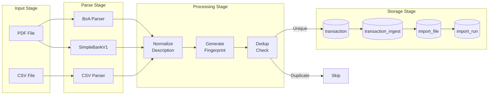
```mermaid
flowchart LR
    subgraph Input["Input Stage"]
        PDF["PDF File"]
        CSV["CSV File"]
    end

    subgraph Parse["Parse Stage"]
        BOA["BoA Parser"]
        SIMPLE["SimpleBankV1"]
        CSVP["CSV Parser"]
    end

    subgraph Process["Processing Stage"]
        NORM["Normalize<br/>Description"]
        FP["Generate<br/>Fingerprint"]
        DEDUP["Dedup<br/>Check"]
    end

    subgraph Store["Storage Stage"]
        RUN[("import_run")]
        FILE[("import_file")]
        TX[("transaction")]
        INGEST[("transaction_ingest")]
    end

    PDF --> BOA
    PDF --> SIMPLE
    CSV --> CSVP

    BOA --> NORM
    SIMPLE --> NORM
    CSVP --> NORM

    NORM --> FP
    FP --> DEDUP

    DEDUP -->|"Unique"| TX
    DEDUP -->|"Duplicate"| SKIP["Skip"]

    TX --> INGEST
    INGEST --> FILE
    FILE --> RUN
```

### 2.2 Classification Flow

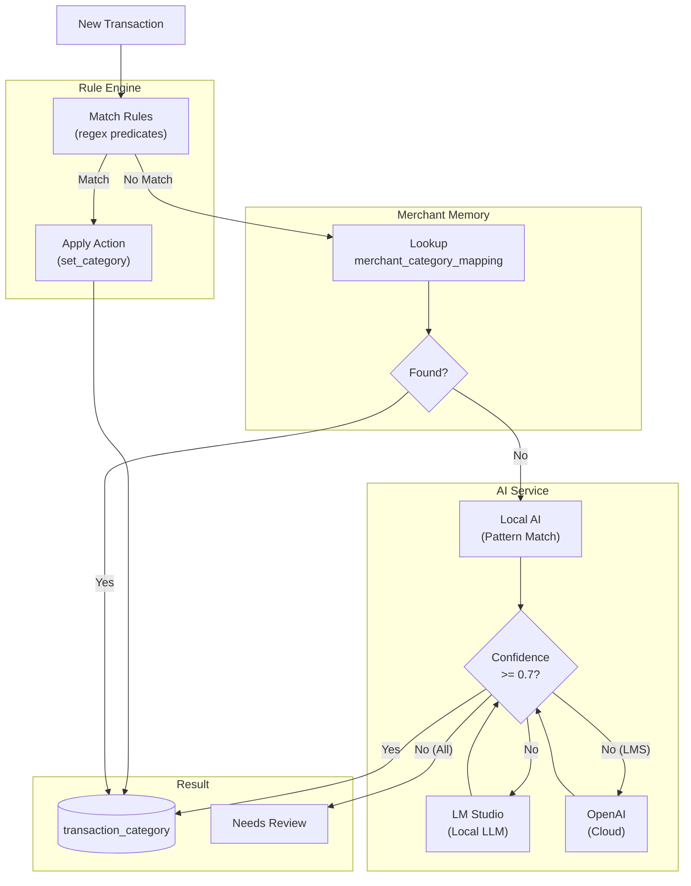
```mermaid
flowchart TD
    TX["New Transaction"]

    subgraph RuleEngine["Rule Engine"]
        RULES["Match Rules<br/>(regex predicates)"]
        APPLY["Apply Action<br/>(set_category)"]
    end

    subgraph MerchantMemory["Merchant Memory"]
        LOOKUP["Lookup<br/>merchant_category_mapping"]
        FOUND{"Found?"}
    end

    subgraph AIService["AI Service"]
        LOCAL["Local AI<br/>(Pattern Match)"]
        LMS["LM Studio<br/>(Local LLM)"]
        OAI["OpenAI<br/>(Cloud)"]
        CONF{"Confidence<br/>>= 0.7?"}
    end

    subgraph Result["Result"]
        CAT[("transaction_category")]
        REVIEW["Needs Review"]
    end

    TX --> RULES
    RULES -->|"Match"| APPLY
    RULES -->|"No Match"| LOOKUP

    APPLY --> CAT

    LOOKUP --> FOUND
    FOUND -->|"Yes"| CAT
    FOUND -->|"No"| LOCAL

    LOCAL --> CONF
    CONF -->|"Yes"| CAT
    CONF -->|"No"| LMS

    LMS --> CONF
    CONF -->|"No (LMS)"| OAI

    OAI --> CONF
    CONF -->|"No (All)"| REVIEW
```

### 2.3 Analytics Flow

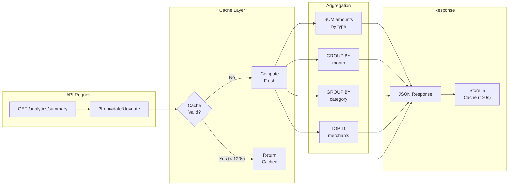
```mermaid
flowchart LR
    subgraph Request["API Request"]
        REQ["GET /analytics/summary"]
        PARAMS["?from=date&to=date"]
    end

    subgraph Cache["Cache Layer"]
        CHECK{"Cache<br/>Valid?"}
        CACHED["Return<br/>Cached"]
        COMPUTE["Compute<br/>Fresh"]
    end

    subgraph Aggregation["Aggregation"]
        TOTALS["SUM amounts<br/>by type"]
        MONTHLY["GROUP BY<br/>month"]
        CATEGORY["GROUP BY<br/>category"]
        MERCHANT["TOP 10<br/>merchants"]
    end

    subgraph Response["Response"]
        JSON["JSON Response"]
        STORE["Store in<br/>Cache (120s)"]
    end

    REQ --> PARAMS
    PARAMS --> CHECK

    CHECK -->|"Yes (< 120s)"| CACHED
    CHECK -->|"No"| COMPUTE

    COMPUTE --> TOTALS
    COMPUTE --> MONTHLY
    COMPUTE --> CATEGORY
    COMPUTE --> MERCHANT

    TOTALS --> JSON
    MONTHLY --> JSON
    CATEGORY --> JSON
    MERCHANT --> JSON

    CACHED --> JSON
    JSON --> STORE
```

### 2.4 Export Flow

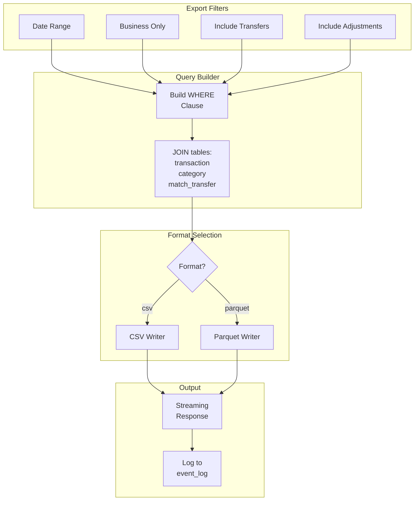
```mermaid
flowchart TD
    subgraph Filters["Export Filters"]
        DATE["Date Range"]
        BIZ["Business Only"]
        TRANS["Include Transfers"]
        ADJ["Include Adjustments"]
    end

    subgraph Query["Query Builder"]
        WHERE["Build WHERE<br/>Clause"]
        JOIN["JOIN tables:<br/>transaction<br/>category<br/>match_transfer"]
    end

    subgraph Format["Format Selection"]
        FMT{"Format?"}
        CSVF["CSV Writer"]
        PARQ["Parquet Writer"]
    end

    subgraph Output["Output"]
        STREAM["Streaming<br/>Response"]
        LOG["Log to<br/>event_log"]
    end

    DATE --> WHERE
    BIZ --> WHERE
    TRANS --> WHERE
    ADJ --> WHERE

    WHERE --> JOIN
    JOIN --> FMT

    FMT -->|"csv"| CSVF
    FMT -->|"parquet"| PARQ

    CSVF --> STREAM
    PARQ --> STREAM

    STREAM --> LOG
```

---

## 3. Entity Relationship Diagram

### Full Database Schema

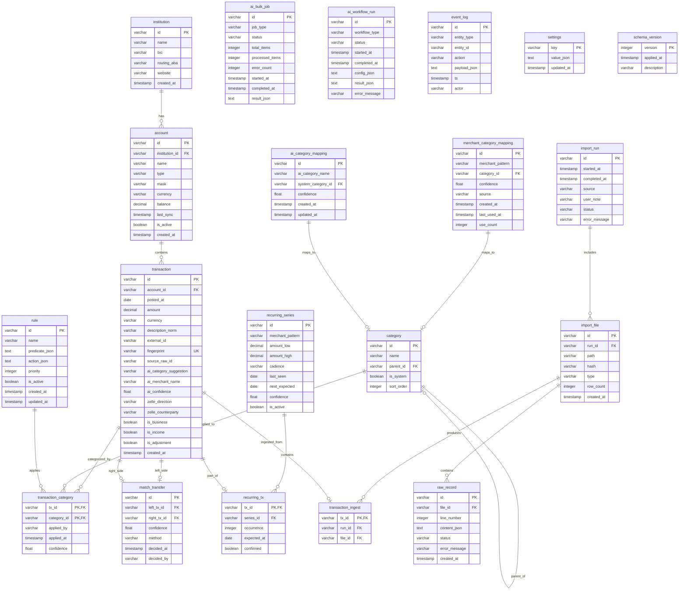
```mermaid
erDiagram
    institution ||--o{ account : "has"
    account ||--o{ transaction : "contains"
    transaction ||--o{ transaction_category : "categorized_by"
    category ||--o{ transaction_category : "applied_to"
    category ||--o| category : "parent_of"

    transaction ||--o| match_transfer : "left_side"
    transaction ||--o| match_transfer : "right_side"

    recurring_series ||--o{ recurring_tx : "contains"
    transaction ||--o| recurring_tx : "part_of"

    import_run ||--o{ import_file : "includes"
    import_file ||--o{ transaction_ingest : "produces"
    transaction ||--o| transaction_ingest : "ingested_from"
    import_file ||--o{ raw_record : "contains"

    rule ||--o{ transaction_category : "applies"

    merchant_category_mapping ||--o| category : "maps_to"

    ai_category_mapping ||--o| category : "maps_to"

    institution {
        varchar id PK
        varchar name
        varchar bic
        varchar routing_aba
        varchar website
        timestamp created_at
    }

    account {
        varchar id PK
        varchar institution_id FK
        varchar name
        varchar type
        varchar mask
        varchar currency
        decimal balance
        timestamp last_sync
        boolean is_active
        timestamp created_at
    }

    transaction {
        varchar id PK
        varchar account_id FK
        date posted_at
        decimal amount
        varchar currency
        varchar description_norm
        varchar external_id
        varchar fingerprint UK
        varchar source_raw_id
        varchar ai_category_suggestion
        varchar ai_merchant_name
        float ai_confidence
        varchar zelle_direction
        varchar zelle_counterparty
        boolean is_business
        boolean is_income
        boolean is_adjustment
        timestamp created_at
    }

    category {
        varchar id PK
        varchar name
        varchar parent_id FK
        boolean is_system
        integer sort_order
    }

    transaction_category {
        varchar tx_id PK,FK
        varchar category_id PK,FK
        varchar applied_by
        timestamp applied_at
        float confidence
    }

    match_transfer {
        varchar id PK
        varchar left_tx_id FK
        varchar right_tx_id FK
        float confidence
        varchar method
        timestamp decided_at
        varchar decided_by
    }

    recurring_series {
        varchar id PK
        varchar merchant_pattern
        decimal amount_low
        decimal amount_high
        varchar cadence
        date last_seen
        date next_expected
        float confidence
        boolean is_active
    }

    recurring_tx {
        varchar tx_id PK,FK
        varchar series_id FK
        integer occurrence
        date expected_at
        boolean confirmed
    }

    import_run {
        varchar id PK
        timestamp started_at
        timestamp completed_at
        varchar source
        varchar user_note
        varchar status
        varchar error_message
    }

    import_file {
        varchar id PK
        varchar run_id FK
        varchar path
        varchar hash
        varchar type
        integer row_count
        timestamp created_at
    }

    raw_record {
        varchar id PK
        varchar file_id FK
        integer line_number
        text content_json
        varchar status
        varchar error_message
        timestamp created_at
    }

    transaction_ingest {
        varchar tx_id PK,FK
        varchar run_id FK
        varchar file_id FK
    }

    rule {
        varchar id PK
        varchar name
        text predicate_json
        text action_json
        integer priority
        boolean is_active
        timestamp created_at
        timestamp updated_at
    }

    merchant_category_mapping {
        varchar id PK
        varchar merchant_pattern
        varchar category_id FK
        float confidence
        varchar source
        timestamp created_at
        timestamp last_used_at
        integer use_count
    }

    ai_bulk_job {
        varchar id PK
        varchar job_type
        varchar status
        integer total_items
        integer processed_items
        integer error_count
        timestamp started_at
        timestamp completed_at
        text result_json
    }

    ai_workflow_run {
        varchar id PK
        varchar workflow_type
        varchar status
        timestamp started_at
        timestamp completed_at
        text config_json
        text result_json
        varchar error_message
    }

    ai_category_mapping {
        varchar id PK
        varchar ai_category_name
        varchar system_category_id FK
        float confidence
        timestamp created_at
        timestamp updated_at
    }

    event_log {
        varchar id PK
        varchar entity_type
        varchar entity_id
        varchar action
        text payload_json
        timestamp ts
        varchar actor
    }

    settings {
        varchar key PK
        text value_json
        timestamp updated_at
    }

    schema_version {
        integer version PK
        timestamp applied_at
        varchar description
    }
```

---

## 4. Sequence Diagrams

### 4a. PDF Import with AI Enhancement

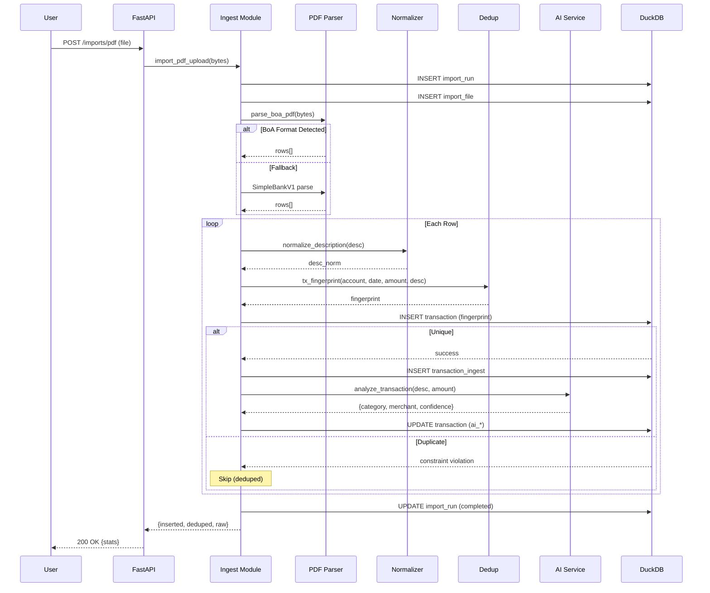
```mermaid
sequenceDiagram
    participant U as User
    participant API as FastAPI
    participant ING as Ingest Module
    participant PARSE as PDF Parser
    participant NORM as Normalizer
    participant DEDUP as Dedup
    participant AI as AI Service
    participant DB as DuckDB

    U->>API: POST /imports/pdf (file)
    API->>ING: import_pdf_upload(bytes)

    ING->>DB: INSERT import_run
    ING->>DB: INSERT import_file

    ING->>PARSE: parse_boa_pdf(bytes)
    alt BoA Format Detected
        PARSE-->>ING: rows[]
    else Fallback
        ING->>PARSE: SimpleBankV1 parse
        PARSE-->>ING: rows[]
    end

    loop Each Row
        ING->>NORM: normalize_description(desc)
        NORM-->>ING: desc_norm

        ING->>DEDUP: tx_fingerprint(account, date, amount, desc)
        DEDUP-->>ING: fingerprint

        ING->>DB: INSERT transaction (fingerprint)
        alt Unique
            DB-->>ING: success
            ING->>DB: INSERT transaction_ingest

            ING->>AI: analyze_transaction(desc, amount)
            AI-->>ING: {category, merchant, confidence}
            ING->>DB: UPDATE transaction (ai_*)
        else Duplicate
            DB-->>ING: constraint violation
            Note over ING: Skip (deduped)
        end
    end

    ING->>DB: UPDATE import_run (completed)
    ING-->>API: {inserted, deduped, raw}
    API-->>U: 200 OK {stats}
```

### 4b. Transaction Classification (Rules → AI Fallback)

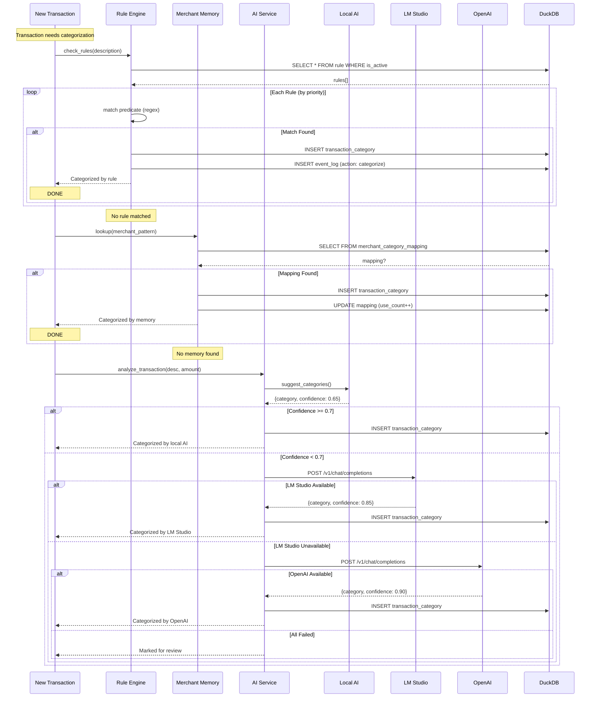
```mermaid
sequenceDiagram
    participant TX as New Transaction
    participant RE as Rule Engine
    participant MM as Merchant Memory
    participant AI as AI Service
    participant LOCAL as Local AI
    participant LMS as LM Studio
    participant OAI as OpenAI
    participant DB as DuckDB

    Note over TX: Transaction needs categorization

    TX->>RE: check_rules(description)
    RE->>DB: SELECT * FROM rule WHERE is_active
    DB-->>RE: rules[]

    loop Each Rule (by priority)
        RE->>RE: match predicate (regex)
        alt Match Found
            RE->>DB: INSERT transaction_category
            RE->>DB: INSERT event_log (action: categorize)
            RE-->>TX: Categorized by rule
            Note over TX: DONE
        end
    end

    Note over RE: No rule matched

    TX->>MM: lookup(merchant_pattern)
    MM->>DB: SELECT FROM merchant_category_mapping
    DB-->>MM: mapping?

    alt Mapping Found
        MM->>DB: INSERT transaction_category
        MM->>DB: UPDATE mapping (use_count++)
        MM-->>TX: Categorized by memory
        Note over TX: DONE
    end

    Note over MM: No memory found

    TX->>AI: analyze_transaction(desc, amount)
    AI->>LOCAL: suggest_categories()
    LOCAL-->>AI: {category, confidence: 0.65}

    alt Confidence >= 0.7
        AI->>DB: INSERT transaction_category
        AI-->>TX: Categorized by local AI
    else Confidence < 0.7
        AI->>LMS: POST /v1/chat/completions
        alt LM Studio Available
            LMS-->>AI: {category, confidence: 0.85}
            AI->>DB: INSERT transaction_category
            AI-->>TX: Categorized by LM Studio
        else LM Studio Unavailable
            AI->>OAI: POST /v1/chat/completions
            alt OpenAI Available
                OAI-->>AI: {category, confidence: 0.90}
                AI->>DB: INSERT transaction_category
                AI-->>TX: Categorized by OpenAI
            else All Failed
                AI-->>TX: Marked for review
            end
        end
    end
```

### 4c. Recurring Detection and Confirmation

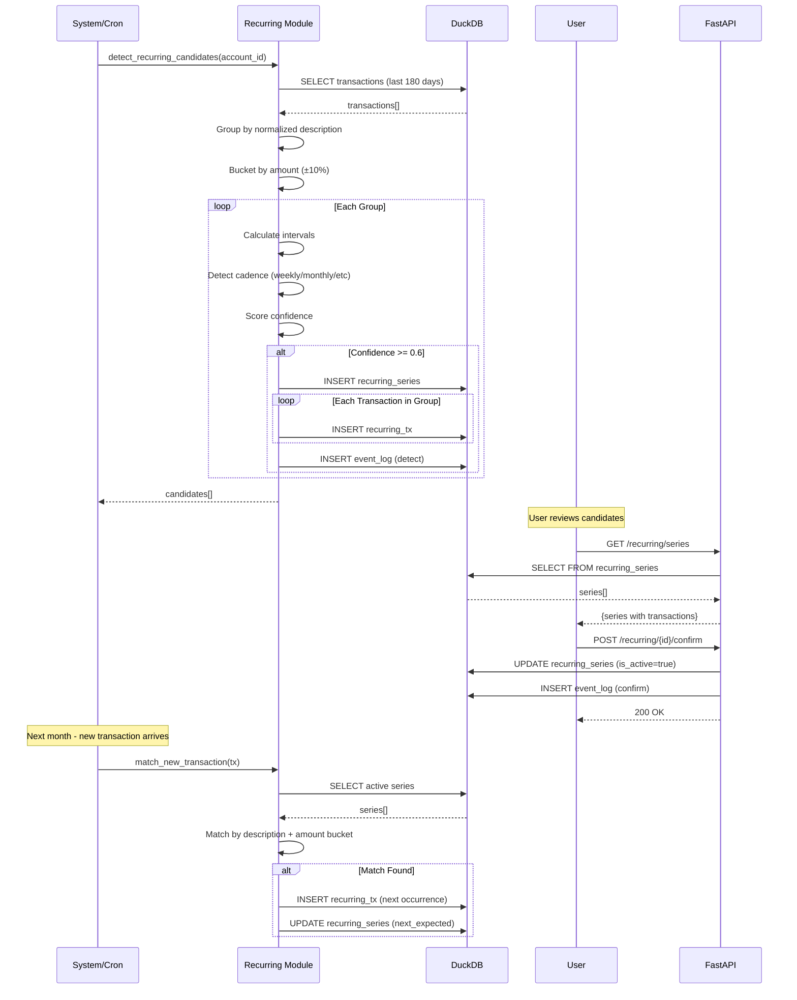
```mermaid
sequenceDiagram
    participant SYS as System/Cron
    participant REC as Recurring Module
    participant DB as DuckDB
    participant U as User
    participant API as FastAPI

    SYS->>REC: detect_recurring_candidates(account_id)

    REC->>DB: SELECT transactions (last 180 days)
    DB-->>REC: transactions[]

    REC->>REC: Group by normalized description
    REC->>REC: Bucket by amount (±10%)

    loop Each Group
        REC->>REC: Calculate intervals
        REC->>REC: Detect cadence (weekly/monthly/etc)
        REC->>REC: Score confidence

        alt Confidence >= 0.6
            REC->>DB: INSERT recurring_series
            loop Each Transaction in Group
                REC->>DB: INSERT recurring_tx
            end
            REC->>DB: INSERT event_log (detect)
        end
    end

    REC-->>SYS: candidates[]

    Note over U: User reviews candidates

    U->>API: GET /recurring/series
    API->>DB: SELECT FROM recurring_series
    DB-->>API: series[]
    API-->>U: {series with transactions}

    U->>API: POST /recurring/{id}/confirm
    API->>DB: UPDATE recurring_series (is_active=true)
    API->>DB: INSERT event_log (confirm)
    API-->>U: 200 OK

    Note over SYS: Next month - new transaction arrives

    SYS->>REC: match_new_transaction(tx)
    REC->>DB: SELECT active series
    DB-->>REC: series[]

    REC->>REC: Match by description + amount bucket
    alt Match Found
        REC->>DB: INSERT recurring_tx (next occurrence)
        REC->>DB: UPDATE recurring_series (next_expected)
    end
```

### 4d. Manual Categorization with Merchant Learning

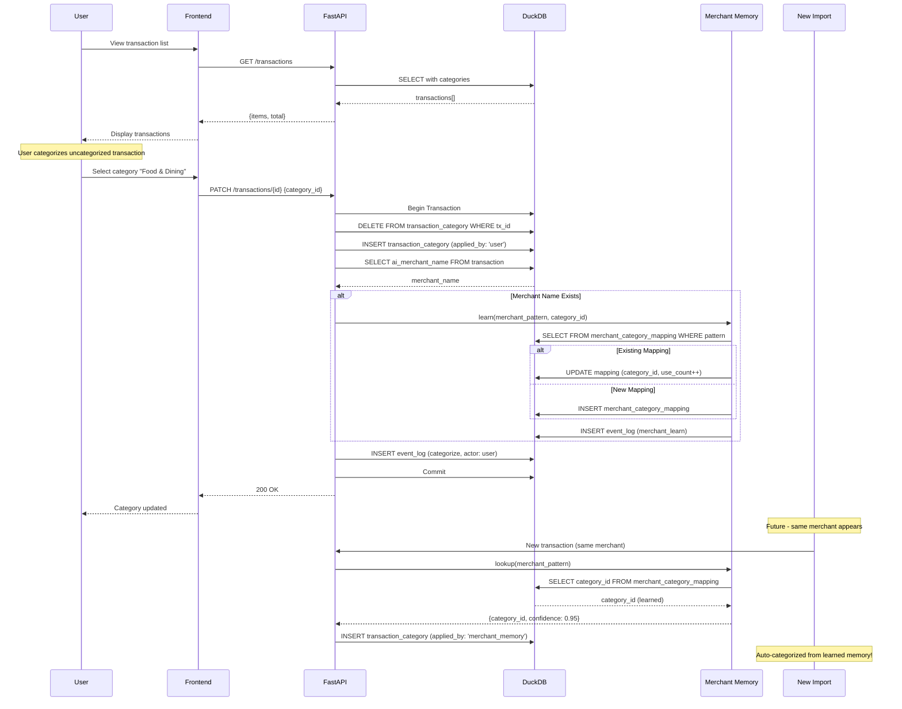
```mermaid
sequenceDiagram
    participant U as User
    participant WEB as Frontend
    participant API as FastAPI
    participant DB as DuckDB
    participant MM as Merchant Memory

    U->>WEB: View transaction list
    WEB->>API: GET /transactions
    API->>DB: SELECT with categories
    DB-->>API: transactions[]
    API-->>WEB: {items, total}
    WEB-->>U: Display transactions

    Note over U: User categorizes uncategorized transaction

    U->>WEB: Select category "Food & Dining"
    WEB->>API: PATCH /transactions/{id} {category_id}

    API->>DB: Begin Transaction

    API->>DB: DELETE FROM transaction_category WHERE tx_id
    API->>DB: INSERT transaction_category (applied_by: 'user')

    API->>DB: SELECT ai_merchant_name FROM transaction
    DB-->>API: merchant_name

    alt Merchant Name Exists
        API->>MM: learn(merchant_pattern, category_id)
        MM->>DB: SELECT FROM merchant_category_mapping WHERE pattern

        alt Existing Mapping
            MM->>DB: UPDATE mapping (category_id, use_count++)
        else New Mapping
            MM->>DB: INSERT merchant_category_mapping
        end

        MM->>DB: INSERT event_log (merchant_learn)
    end

    API->>DB: INSERT event_log (categorize, actor: user)
    API->>DB: Commit

    API-->>WEB: 200 OK
    WEB-->>U: Category updated

    Note over SYS: Future - same merchant appears

    participant SYS as New Import

    SYS->>API: New transaction (same merchant)
    API->>MM: lookup(merchant_pattern)
    MM->>DB: SELECT category_id FROM merchant_category_mapping
    DB-->>MM: category_id (learned)
    MM-->>API: {category_id, confidence: 0.95}
    API->>DB: INSERT transaction_category (applied_by: 'merchant_memory')

    Note over SYS: Auto-categorized from learned memory!
```

---

## 5. Component Diagram

### 5.1 Backend Module Dependencies

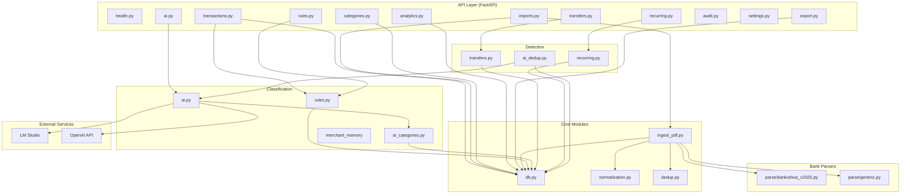
```mermaid
flowchart TB
    subgraph API["API Layer (FastAPI)"]
        HEALTH["health.py"]
        TX["transactions.py"]
        IMP["imports.py"]
        CAT["categories.py"]
        RULES["rules.py"]
        TRANS["transfers.py"]
        RECUR["recurring.py"]
        ANALYTICS["analytics.py"]
        EXPORT["export.py"]
        AUDIT["audit.py"]
        SETTINGS["settings.py"]
        AI_ROUTES["ai.py"]
    end

    subgraph Core["Core Modules"]
        DB["db.py"]
        NORM["normalization.py"]
        DEDUP["dedup.py"]
        INGEST["ingest_pdf.py"]
    end

    subgraph Classification["Classification"]
        RULES_ENGINE["rules.py"]
        AI_SERVICE["ai.py"]
        AI_CAT["ai_categories.py"]
        MERCHANT["merchant_memory"]
    end

    subgraph Detection["Detection"]
        TRANS_DETECT["transfers.py"]
        RECUR_DETECT["recurring.py"]
        AI_DEDUP["ai_dedup.py"]
    end

    subgraph Parsers["Bank Parsers"]
        BOA["parse/banks/boa_v2025.py"]
        GENERIC["parse/generic.py"]
    end

    subgraph External["External Services"]
        LMS_EXT["LM Studio"]
        OAI_EXT["OpenAI API"]
    end

    %% API dependencies
    TX --> DB
    TX --> RULES_ENGINE
    IMP --> INGEST
    IMP --> DB
    CAT --> DB
    RULES --> RULES_ENGINE
    TRANS --> TRANS_DETECT
    RECUR --> RECUR_DETECT
    ANALYTICS --> DB
    EXPORT --> DB
    AI_ROUTES --> AI_SERVICE

    %% Core dependencies
    INGEST --> BOA
    INGEST --> GENERIC
    INGEST --> NORM
    INGEST --> DEDUP
    INGEST --> DB

    %% Classification dependencies
    RULES_ENGINE --> DB
    AI_SERVICE --> AI_CAT
    AI_SERVICE --> LMS_EXT
    AI_SERVICE --> OAI_EXT
    AI_CAT --> DB

    %% Detection dependencies
    TRANS_DETECT --> DB
    RECUR_DETECT --> DB
    AI_DEDUP --> AI_SERVICE
    AI_DEDUP --> DB
```

### 5.2 Frontend Component Architecture

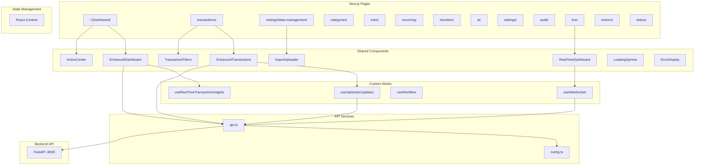
```mermaid
flowchart TB
    subgraph Pages["Next.js Pages"]
        DASH["/ (Dashboard)"]
        TRANS_PAGE["transactions/"]
        IMPORT_PAGE["settings/data-management/"]
        CAT_PAGE["categories/"]
        RULES_PAGE["rules/"]
        RECUR_PAGE["recurring/"]
        TRANS_PAGE2["transfers/"]
        AI_PAGE["ai/"]
        SETTINGS_PAGE["settings/"]
        AUDIT_PAGE["audit/"]
        LIVE_PAGE["live/"]
        METRICS_PAGE["metrics/"]
        STATUS_PAGE["status/"]
    end

    subgraph Components["Shared Components"]
        DASHBOARD_COMP["EnhancedDashboard"]
        TX_COMP["EnhancedTransactions"]
        FILTERS["TransactionFilters"]
        ACTION["ActionCenter"]
        IMPORT_COMP["ImportUploader"]
        REALTIME["RealTimeDashboard"]
        LOADING["LoadingSpinner"]
        ERROR["ErrorDisplay"]
    end

    subgraph Hooks["Custom Hooks"]
        USE_WS["useWebSocket"]
        USE_OPT["useOptimisticUpdates"]
        USE_WORKFLOW["useWorkflow"]
        USE_REALTIME["useRealTimeTransactionInsights"]
    end

    subgraph Services["API Services"]
        API_CLIENT["api.ts"]
        CONFIG["config.ts"]
    end

    subgraph Stores["State Management"]
        CONTEXT["React Context"]
    end

    subgraph Backend["Backend API"]
        FASTAPI["FastAPI :8000"]
    end

    %% Page to Component
    DASH --> DASHBOARD_COMP
    DASH --> ACTION
    TRANS_PAGE --> TX_COMP
    TRANS_PAGE --> FILTERS
    IMPORT_PAGE --> IMPORT_COMP
    LIVE_PAGE --> REALTIME

    %% Components to Hooks
    DASHBOARD_COMP --> USE_REALTIME
    TX_COMP --> USE_OPT
    REALTIME --> USE_WS

    %% Hooks/Components to Services
    USE_WS --> API_CLIENT
    USE_OPT --> API_CLIENT
    DASHBOARD_COMP --> API_CLIENT
    TX_COMP --> API_CLIENT

    %% Services to Backend
    API_CLIENT --> CONFIG
    API_CLIENT --> FASTAPI
```

---

## 6. State Diagrams

### 6.1 Transaction State Machine

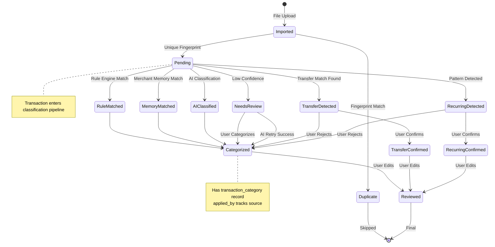
```mermaid
stateDiagram-v2
    [*] --> Imported: File Upload

    Imported --> Duplicate: Fingerprint Match
    Imported --> Pending: Unique Fingerprint

    Duplicate --> [*]: Skipped

    Pending --> RuleMatched: Rule Engine Match
    Pending --> MemoryMatched: Merchant Memory Match
    Pending --> AIClassified: AI Classification
    Pending --> NeedsReview: Low Confidence
    Pending --> TransferDetected: Transfer Match Found
    Pending --> RecurringDetected: Pattern Detected

    RuleMatched --> Categorized
    MemoryMatched --> Categorized
    AIClassified --> Categorized

    NeedsReview --> Categorized: User Categorizes
    NeedsReview --> Categorized: AI Retry Success

    TransferDetected --> TransferConfirmed: User Confirms
    TransferDetected --> Categorized: User Rejects

    RecurringDetected --> RecurringConfirmed: User Confirms
    RecurringDetected --> Categorized: User Rejects

    Categorized --> Reviewed: User Edits
    TransferConfirmed --> Reviewed: User Edits
    RecurringConfirmed --> Reviewed: User Edits

    Reviewed --> [*]: Final

    note right of Pending
        Transaction enters classification pipeline
    end note

    note right of Categorized
        Has transaction_category record
        applied_by tracks source
    end note
```

### 6.2 Transfer State Machine

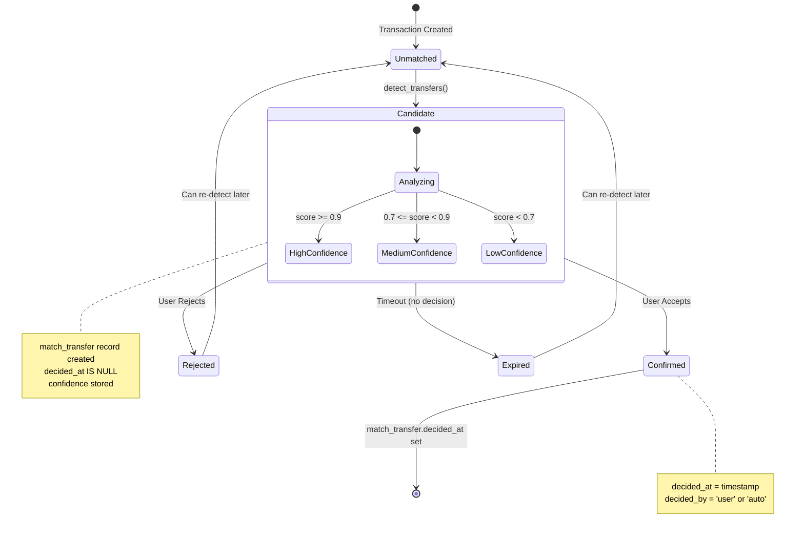
```mermaid
stateDiagram-v2
    [*] --> Unmatched: Transaction Created

    Unmatched --> Candidate: detect_transfers()

    state Candidate {
        [*] --> Analyzing
        Analyzing --> HighConfidence: score >= 0.9
        Analyzing --> MediumConfidence: 0.7 <= score < 0.9
        Analyzing --> LowConfidence: score < 0.7
    }

    Candidate --> Confirmed: User Accepts
    Candidate --> Rejected: User Rejects
    Candidate --> Expired: Timeout (no decision)

    Confirmed --> [*]: match_transfer.decided_at set
    Rejected --> Unmatched: Can re-detect later
    Expired --> Unmatched: Can re-detect later

    note right of Candidate
        match_transfer record created
        decided_at IS NULL
        confidence stored
    end note

    note right of Confirmed
        decided_at = timestamp
        decided_by = 'user' or 'auto'
    end note
```

### 6.3 Recurring Series State Machine

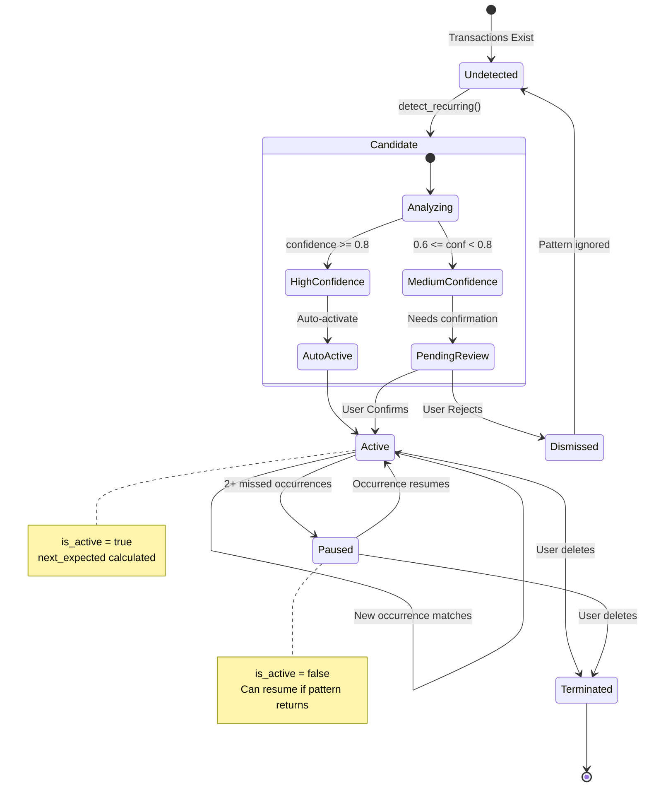
```mermaid
stateDiagram-v2
    [*] --> Undetected: Transactions Exist

    Undetected --> Candidate: detect_recurring()

    state Candidate {
        [*] --> Analyzing
        Analyzing --> HighConfidence: confidence >= 0.8
        Analyzing --> MediumConfidence: 0.6 <= conf < 0.8

        HighConfidence --> AutoActive: Auto-activate
        MediumConfidence --> PendingReview: Needs confirmation
    }

    AutoActive --> Active
    PendingReview --> Active: User Confirms
    PendingReview --> Dismissed: User Rejects

    Active --> Active: New occurrence matches
    Active --> Paused: 2+ missed occurrences
    Active --> Terminated: User deletes

    Paused --> Active: Occurrence resumes
    Paused --> Terminated: User deletes

    Dismissed --> Undetected: Pattern ignored
    Terminated --> [*]

    note right of Active
        is_active = true
        next_expected calculated
    end note

    note right of Paused
        is_active = false
        Can resume if pattern returns
    end note
```

### 6.4 Import Run State Machine

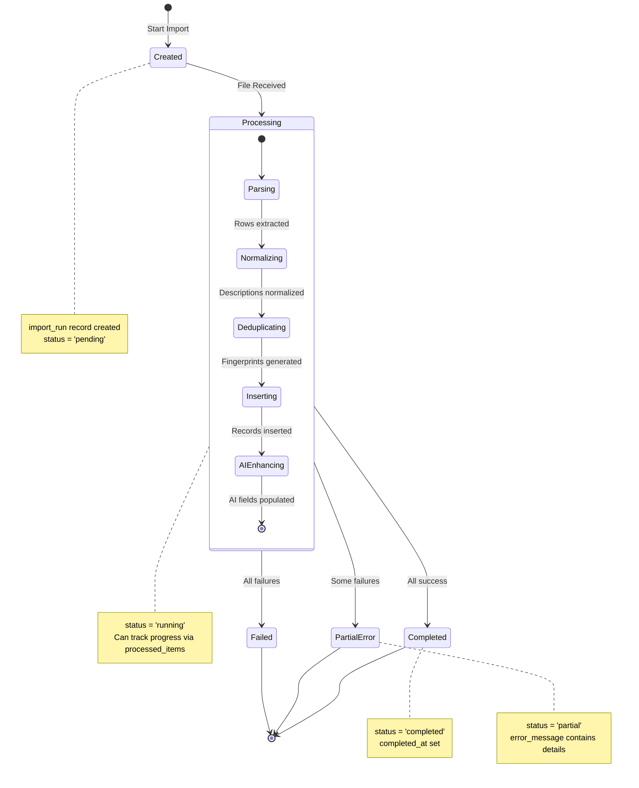
```mermaid
stateDiagram-v2
    [*] --> Created: Start Import

    Created --> Processing: File Received

    state Processing {
        [*] --> Parsing
        Parsing --> Normalizing: Rows extracted
        Normalizing --> Deduplicating: Descriptions normalized
        Deduplicating --> Inserting: Fingerprints generated
        Inserting --> AIEnhancing: Records inserted
        AIEnhancing --> [*]: AI fields populated
    }

    Processing --> Completed: All success
    Processing --> PartialError: Some failures
    Processing --> Failed: All failures

    Completed --> [*]
    PartialError --> [*]
    Failed --> [*]

    note right of Created
        import_run record created
        status = 'pending'
    end note

    note right of Processing
        status = 'running'
        Can track progress via processed_items
    end note

    note right of Completed
        status = 'completed'
        completed_at set
    end note

    note right of PartialError
        status = 'partial'
        error_message contains details
    end note
```

### 6.5 AI Classification Decision State

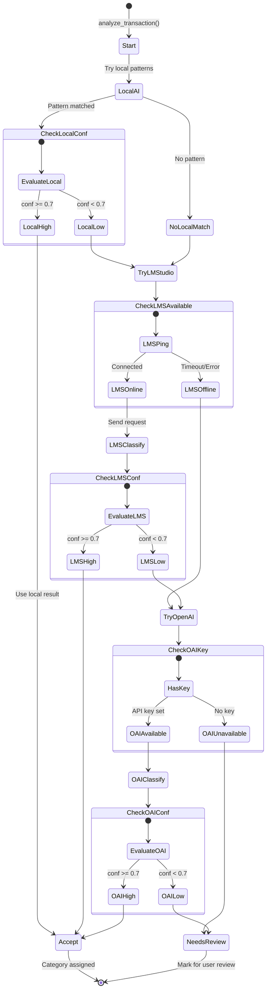
```mermaid
stateDiagram-v2
    [*] --> Start: analyze_transaction()

    Start --> LocalAI: Try local patterns

    LocalAI --> CheckLocalConf: Pattern matched
    LocalAI --> NoLocalMatch: No pattern

    state CheckLocalConf {
        [*] --> EvaluateLocal
        EvaluateLocal --> LocalHigh: conf >= 0.7
        EvaluateLocal --> LocalLow: conf < 0.7
    }

    LocalHigh --> Accept: Use local result
    LocalLow --> TryLMStudio
    NoLocalMatch --> TryLMStudio

    TryLMStudio --> CheckLMSAvailable

    state CheckLMSAvailable {
        [*] --> LMSPing
        LMSPing --> LMSOnline: Connected
        LMSPing --> LMSOffline: Timeout/Error
    }

    LMSOnline --> LMSClassify: Send request
    LMSOffline --> TryOpenAI

    LMSClassify --> CheckLMSConf

    state CheckLMSConf {
        [*] --> EvaluateLMS
        EvaluateLMS --> LMSHigh: conf >= 0.7
        EvaluateLMS --> LMSLow: conf < 0.7
    }

    LMSHigh --> Accept
    LMSLow --> TryOpenAI

    TryOpenAI --> CheckOAIKey

    state CheckOAIKey {
        [*] --> HasKey
        HasKey --> OAIAvailable: API key set
        HasKey --> OAIUnavailable: No key
    }

    OAIAvailable --> OAIClassify
    OAIUnavailable --> NeedsReview

    OAIClassify --> CheckOAIConf

    state CheckOAIConf {
        [*] --> EvaluateOAI
        EvaluateOAI --> OAIHigh: conf >= 0.7
        EvaluateOAI --> OAILow: conf < 0.7
    }

    OAIHigh --> Accept
    OAILow --> NeedsReview

    Accept --> [*]: Category assigned
    NeedsReview --> [*]: Mark for user review
```

---

## Appendix: Mermaid Rendering Notes

To render these diagrams:

1. **GitHub**: Mermaid is natively supported in GitHub markdown
2. **VS Code**: Install "Markdown Preview Mermaid Support" extension
3. **Online**: Use [mermaid.live](https://mermaid.live/) for interactive editing
4. **Documentation**: Use tools like Docusaurus, MkDocs with mermaid plugins

### Diagram Types Used

| Type | Syntax | Use Case |
|------|--------|----------|
| Flowchart | `flowchart TB/LR` | Data flows, component relationships |
| Sequence | `sequenceDiagram` | API interactions, process flows |
| ERD | `erDiagram` | Database schema |
| State | `stateDiagram-v2` | Entity lifecycles |
| C4 Context | `C4Context` | System boundaries (requires C4 extension) |

---

*Document generated: 2025-12-15*
*LedgerLoop Architecture Diagrams v1.0*
