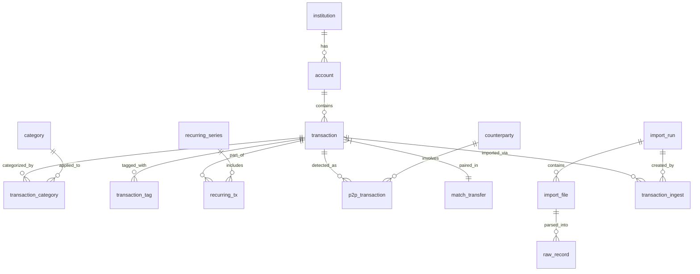

# Database Schema Documentation

## Overview

LedgerLoop uses **SQLite** with WAL (Write-Ahead Logging) mode for concurrent read access. The schema is defined in `db.py` and evolves through numbered SQL migrations in `apps/backend/db/migrations/`.

## Core Tables

### institution
```sql
CREATE TABLE institution (
    id TEXT PRIMARY KEY,
    name TEXT NOT NULL
);
```
**Purpose:** Financial institution registry (banks, credit unions)

### account
```sql
CREATE TABLE account (
    id TEXT PRIMARY KEY,
    institution_id TEXT,
    name TEXT NOT NULL,
    type TEXT,
    last4 TEXT,
    currency TEXT,
    FOREIGN KEY (institution_id) REFERENCES institution(id)
);
```
**Purpose:** Individual financial accounts (checking, savings, credit card)

### transaction
```sql
CREATE TABLE [transaction] (
    id TEXT PRIMARY KEY,
    account_id TEXT NOT NULL,
    posted_at TEXT NOT NULL,
    amount REAL NOT NULL,
    currency TEXT,
    description_norm TEXT NOT NULL,
    external_id TEXT,
    fingerprint TEXT NOT NULL,
    source_raw_id TEXT,
    is_business INTEGER NOT NULL DEFAULT 0,
    is_income INTEGER NOT NULL DEFAULT 0,
    is_adjustment INTEGER NOT NULL DEFAULT 0,
    zelle_direction TEXT,
    zelle_counterparty TEXT,
    p2p_provider TEXT,
    p2p_direction TEXT,
    p2p_counterparty TEXT,
    payee_alias TEXT,
    ai_merchant_name TEXT,
    ai_category_suggestions TEXT,
    ai_confidence_score REAL,
    ai_processed_at TEXT,
    ai_provider TEXT,
    ai_model TEXT,
    ai_latency_ms INTEGER,
    created_at TEXT NOT NULL,
    FOREIGN KEY (account_id) REFERENCES account(id)
);

CREATE INDEX idx_tx_account_date ON [transaction](account_id, posted_at);
CREATE UNIQUE INDEX ux_tx_fingerprint ON [transaction](fingerprint);
```
**Purpose:** Core transaction storage with AI enhancement fields

| Column | Type | Purpose |
|--------|------|---------|
| id | TEXT | UUID primary key |
| account_id | TEXT | FK to account |
| posted_at | TEXT | ISO date when posted |
| amount | REAL | Amount (negative = debit) |
| description_norm | TEXT | Normalized description |
| fingerprint | TEXT | SHA1 hash for dedup |
| is_business | INTEGER | Business expense flag |
| is_income | INTEGER | Income flag |
| is_adjustment | INTEGER | Cashback/reversal flag |
| zelle_* | TEXT | Zelle-specific metadata |
| p2p_* | TEXT | P2P payment metadata |
| ai_* | TEXT/REAL | AI processing results |

### category
```sql
CREATE TABLE category (
    id TEXT PRIMARY KEY,
    name TEXT NOT NULL,
    parent_id TEXT,
    normalized_name TEXT
);

CREATE UNIQUE INDEX ux_category_normalized ON category(normalized_name);
```
**Purpose:** Hierarchical transaction categories

### transaction_category
```sql
CREATE TABLE transaction_category (
    tx_id TEXT NOT NULL,
    category_id TEXT NOT NULL,
    applied_by TEXT,
    PRIMARY KEY (tx_id, category_id),
    FOREIGN KEY (tx_id) REFERENCES [transaction](id),
    FOREIGN KEY (category_id) REFERENCES category(id)
);
```
**Purpose:** Many-to-many relationship between transactions and categories

### rule
```sql
CREATE TABLE rule (
    id TEXT PRIMARY KEY,
    priority INTEGER NOT NULL,
    predicate_json TEXT NOT NULL,
    action_json TEXT NOT NULL,
    enabled INTEGER NOT NULL DEFAULT 1
);
```
**Purpose:** Automated categorization rules

---

## Import Tracking Tables

### import_run
```sql
CREATE TABLE import_run (
    id TEXT PRIMARY KEY,
    started_at TEXT NOT NULL,
    source TEXT,
    user_note TEXT,
    ai_enhanced_count INTEGER DEFAULT 0,
    ai_avg_quality_score REAL DEFAULT 0.0,
    ai_anomalies_detected INTEGER DEFAULT 0,
    ai_analysis_complete INTEGER DEFAULT 0,
    ai_suggested_rules_count INTEGER DEFAULT 0,
    ai_workflow_id TEXT
);
```
**Purpose:** Import session tracking with AI metrics

### import_file
```sql
CREATE TABLE import_file (
    id TEXT PRIMARY KEY,
    run_id TEXT NOT NULL,
    path TEXT,
    hash TEXT,
    type TEXT,
    FOREIGN KEY (run_id) REFERENCES import_run(id)
);

CREATE INDEX idx_import_file_run ON import_file(run_id);
```
**Purpose:** Individual file tracking within import runs

### raw_record
```sql
CREATE TABLE raw_record (
    id TEXT PRIMARY KEY,
    file_id TEXT NOT NULL,
    row_no INTEGER NOT NULL,
    raw_json TEXT NOT NULL,
    parsed_at TEXT NOT NULL,
    FOREIGN KEY (file_id) REFERENCES import_file(id)
);
```
**Purpose:** Raw CSV/PDF row data preservation

### transaction_ingest
```sql
CREATE TABLE transaction_ingest (
    tx_id TEXT PRIMARY KEY,
    run_id TEXT,
    file_id TEXT
);

CREATE INDEX idx_transaction_ingest_run ON transaction_ingest(run_id);
CREATE INDEX idx_transaction_ingest_file ON transaction_ingest(file_id);
```
**Purpose:** Links transactions to their import source

---

## Financial Intelligence Tables

### match_transfer
```sql
CREATE TABLE match_transfer (
    left_tx_id TEXT NOT NULL,
    right_tx_id TEXT NOT NULL,
    group_id TEXT,
    score REAL,
    method TEXT,
    decided_at TEXT,
    include_in_analytics INTEGER DEFAULT 0,
    PRIMARY KEY (left_tx_id, right_tx_id)
);
```
**Purpose:** Transfer pair matching (same amount, opposite directions)

### recurring_series
```sql
CREATE TABLE recurring_series (
    id TEXT PRIMARY KEY,
    name TEXT,
    cadence TEXT,
    anchor_day INTEGER,
    amount_mean REAL,
    amount_sd REAL,
    rule_ref TEXT,
    status TEXT,
    decided_at TEXT,
    first_date TEXT,
    last_date TEXT,
    next_date TEXT,
    occurrences INTEGER,
    price_hike INTEGER,
    recurring_type TEXT,
    sub_category TEXT,
    is_essential INTEGER DEFAULT 0,
    annual_cost REAL,
    predicted_end_date TEXT,
    lender_name TEXT,
    estimated_remaining INTEGER,
    display_name TEXT,
    series_key TEXT,
    llm_confidence REAL,
    llm_provider TEXT,
    llm_classified_at TEXT,
    prediction_confidence REAL,
    next_predicted_amount REAL,
    series_type TEXT,
    p2p_counterparty_id TEXT,
    p2p_service TEXT
);

CREATE INDEX idx_recurring_series_key ON recurring_series(series_key);
CREATE INDEX idx_recurring_status ON recurring_series(status);
CREATE INDEX idx_recurring_type ON recurring_series(recurring_type);
CREATE INDEX idx_recurring_next_date ON recurring_series(next_date);
```
**Purpose:** Recurring payment series (subscriptions, bills, loans)

| Column | Purpose |
|--------|---------|
| cadence | weekly, biweekly, monthly, quarterly, yearly |
| recurring_type | subscription, bill, loan, credit_card, insurance |
| is_essential | Essential vs discretionary |
| annual_cost | Annualized cost calculation |
| llm_* | AI classification metadata |

### recurring_tx
```sql
CREATE TABLE recurring_tx (
    series_id TEXT NOT NULL,
    tx_id TEXT NOT NULL,
    PRIMARY KEY (series_id, tx_id)
);
```
**Purpose:** Links transactions to recurring series

---

## P2P Transaction Tables

### p2p_transaction
```sql
CREATE TABLE p2p_transaction (
    id TEXT PRIMARY KEY,
    tx_id TEXT NOT NULL,
    service TEXT NOT NULL,
    counterparty_raw TEXT,
    counterparty_normalized TEXT,
    direction TEXT,
    confidence REAL DEFAULT 1.0,
    detection_method TEXT,
    ai_analyzed_at TEXT,
    metadata TEXT,
    created_at TEXT DEFAULT (datetime('now')),
    transaction_type TEXT,
    counterparty_type TEXT,
    merchant_category TEXT,
    ai_enriched_at TEXT,
    ai_confidence REAL,
    is_recurring INTEGER DEFAULT 0,
    recurring_series_id TEXT,
    FOREIGN KEY (tx_id) REFERENCES [transaction](id)
);

CREATE INDEX idx_p2p_tx ON p2p_transaction(tx_id);
CREATE INDEX idx_p2p_counterparty ON p2p_transaction(counterparty_normalized);
CREATE INDEX idx_p2p_service ON p2p_transaction(service);
CREATE INDEX idx_p2p_type ON p2p_transaction(transaction_type);
```
**Purpose:** P2P payment detection (Zelle, Venmo, CashApp, PayPal)

### counterparty
```sql
CREATE TABLE counterparty (
    id TEXT PRIMARY KEY,
    name_normalized TEXT NOT NULL UNIQUE,
    aliases TEXT,
    total_sent REAL DEFAULT 0,
    total_received REAL DEFAULT 0,
    transaction_count INTEGER DEFAULT 0,
    first_seen TEXT,
    last_seen TEXT,
    is_recurring INTEGER DEFAULT 0,
    notes TEXT,
    counterparty_type TEXT,
    category TEXT
);

CREATE INDEX idx_counterparty_name ON counterparty(name_normalized);
```
**Purpose:** P2P counterparty registry with aggregated stats

---

## AI & Machine Learning Tables

### ai_bulk_job
```sql
CREATE TABLE ai_bulk_job (
    id TEXT PRIMARY KEY,
    job_type TEXT NOT NULL,
    total_transactions INTEGER NOT NULL,
    processed_transactions INTEGER DEFAULT 0,
    enhanced_transactions INTEGER DEFAULT 0,
    status TEXT DEFAULT 'processing',
    created_at TEXT NOT NULL,
    completed_at TEXT,
    error_message TEXT
);
```
**Purpose:** Background AI processing job tracking

### ai_workflow_run
```sql
CREATE TABLE ai_workflow_run (
    id TEXT PRIMARY KEY,
    started_at TEXT NOT NULL,
    completed_at TEXT,
    total_transactions INTEGER DEFAULT 0,
    enhanced_transactions INTEGER DEFAULT 0,
    categorized_transactions INTEGER DEFAULT 0,
    duplicates_found INTEGER DEFAULT 0,
    duplicates_merged INTEGER DEFAULT 0,
    success_rate REAL DEFAULT 0.0,
    config_json TEXT,
    quality_report_json TEXT,
    errors_json TEXT
);
```
**Purpose:** AI workflow execution tracking

### ai_category_mapping
```sql
CREATE TABLE ai_category_mapping (
    provider TEXT,
    source_label TEXT NOT NULL,
    category_id TEXT NOT NULL,
    PRIMARY KEY (provider, source_label)
);
```
**Purpose:** Maps AI provider labels to internal categories

### ai_suggestion_opt_out
```sql
CREATE TABLE ai_suggestion_opt_out (
    merchant TEXT NOT NULL,
    category_name TEXT NOT NULL,
    created_at TEXT NOT NULL,
    PRIMARY KEY (merchant, category_name)
);
```
**Purpose:** User opt-outs for AI suggestions

### merchant_category_mapping
```sql
CREATE TABLE merchant_category_mapping (
    id TEXT PRIMARY KEY,
    merchant_name TEXT NOT NULL,
    merchant_pattern TEXT NOT NULL,
    category_id TEXT NOT NULL,
    confidence REAL DEFAULT 1.0,
    confidence_i INTEGER,
    usage_count INTEGER DEFAULT 1,
    last_used TEXT,
    created_at TEXT,
    UNIQUE(merchant_pattern, category_id)
);
```
**Purpose:** Learned merchant-to-category mappings (merchant memory)

### merchant_intelligence_cache
```sql
CREATE TABLE merchant_intelligence_cache (
    id TEXT PRIMARY KEY,
    raw_description TEXT NOT NULL,
    description_hash TEXT NOT NULL,
    clean_merchant_name TEXT,
    recurring_type TEXT,
    sub_category TEXT,
    is_essential INTEGER,
    confidence REAL DEFAULT 0.0,
    provider TEXT,
    model TEXT,
    latency_ms INTEGER,
    created_at TEXT NOT NULL,
    expires_at TEXT,
    hit_count INTEGER DEFAULT 0,
    last_hit_at TEXT,
    UNIQUE(description_hash)
);

CREATE INDEX idx_mic_hash ON merchant_intelligence_cache(description_hash);
```
**Purpose:** LLM response cache for merchant intelligence

---

## Workflow & State Tables

### workflow_state
```sql
CREATE TABLE workflow_state (
    id TEXT PRIMARY KEY,
    type TEXT,
    status TEXT,
    state_json TEXT NOT NULL,
    created_ts TEXT NOT NULL,
    updated_ts TEXT NOT NULL
);
```
**Purpose:** Persisted workflow state for resumable operations

---

## Audit & Logging Tables

### event_log
```sql
CREATE TABLE event_log (
    id TEXT PRIMARY KEY,
    entity_type TEXT NOT NULL,
    entity_id TEXT NOT NULL,
    action TEXT NOT NULL,
    payload_json TEXT,
    ts TEXT NOT NULL,
    actor TEXT
);
```
**Purpose:** Complete audit trail for all user/system actions

### transaction_tag
```sql
CREATE TABLE transaction_tag (
    tx_id TEXT NOT NULL,
    tag TEXT NOT NULL,
    PRIMARY KEY (tx_id, tag)
);
```
**Purpose:** Flexible transaction tagging

---

## Schema Versioning

### schema_version
```sql
CREATE TABLE schema_version (
    version INTEGER NOT NULL,
    applied_at TEXT NOT NULL
);
```
**Purpose:** Tracks applied migrations

---

## Entity Relationship Diagram



---

## Key Indexes

| Table | Index | Columns | Purpose |
|-------|-------|---------|---------|
| transaction | idx_tx_account_date | account_id, posted_at | Account queries |
| transaction | ux_tx_fingerprint | fingerprint | Deduplication |
| recurring_series | idx_recurring_series_key | series_key | Series lookup |
| recurring_series | idx_recurring_status | status | Filter by status |
| p2p_transaction | idx_p2p_counterparty | counterparty_normalized | Counterparty lookup |
| merchant_intelligence_cache | idx_mic_hash | description_hash | Cache lookup |

---

## Migration History

| Version | File | Changes |
|---------|------|---------|
| 1 | 0001_baseline.sql | Core schema |
| 2 | 0002_predictive_analytics.sql | Predictive tables |
| 3 | 0003_category_normalized.sql | Category normalization |
| 4 | 0004_workflows.sql | Workflow state |
| 5 | 0005_recurring_series_key.sql | Recurring series key index |

---

*Generated by Claude Code Audit - December 27, 2025*
