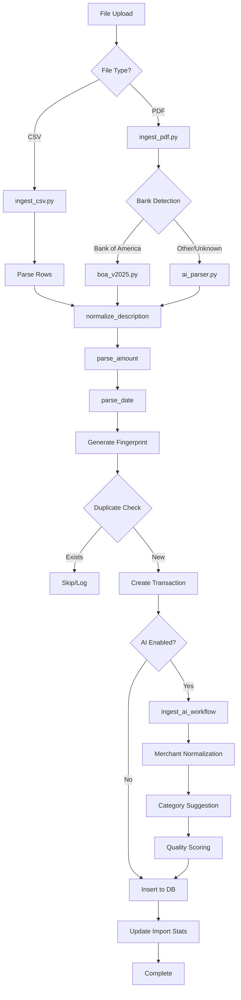
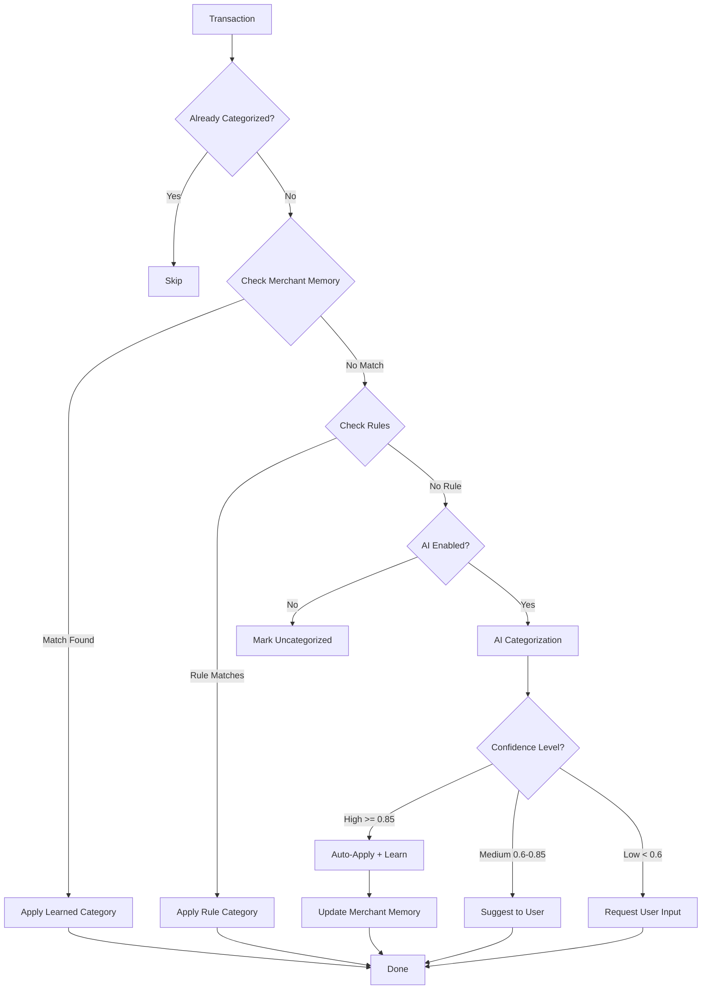
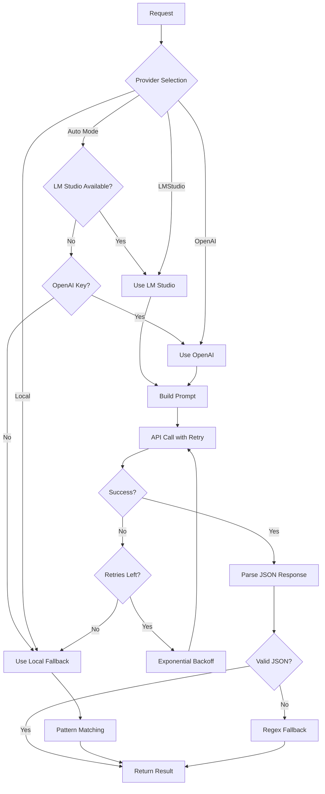
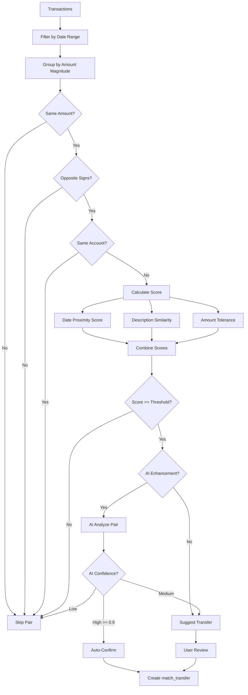
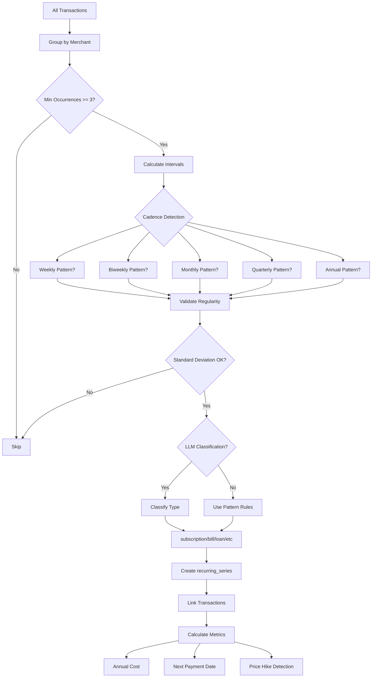
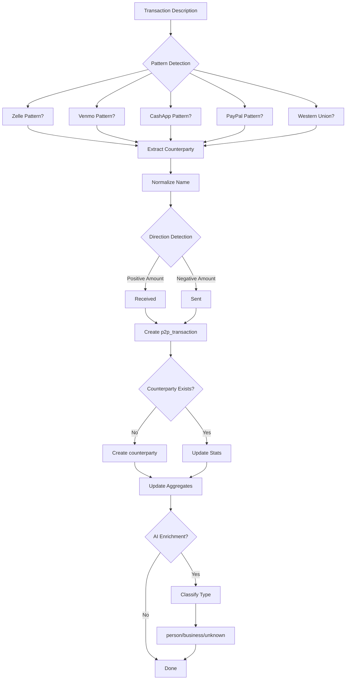
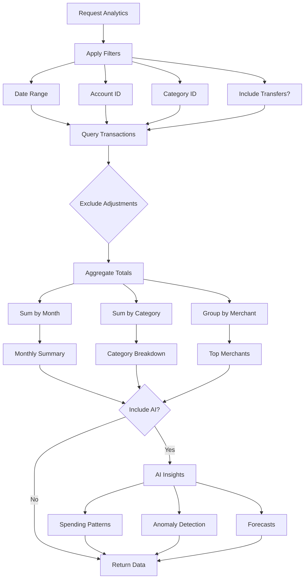
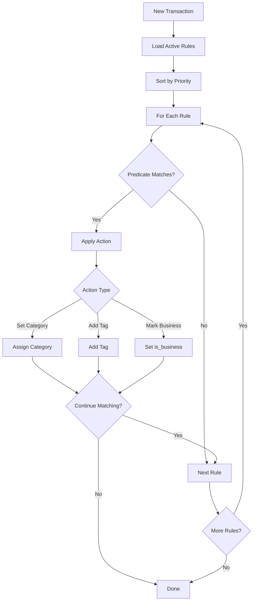
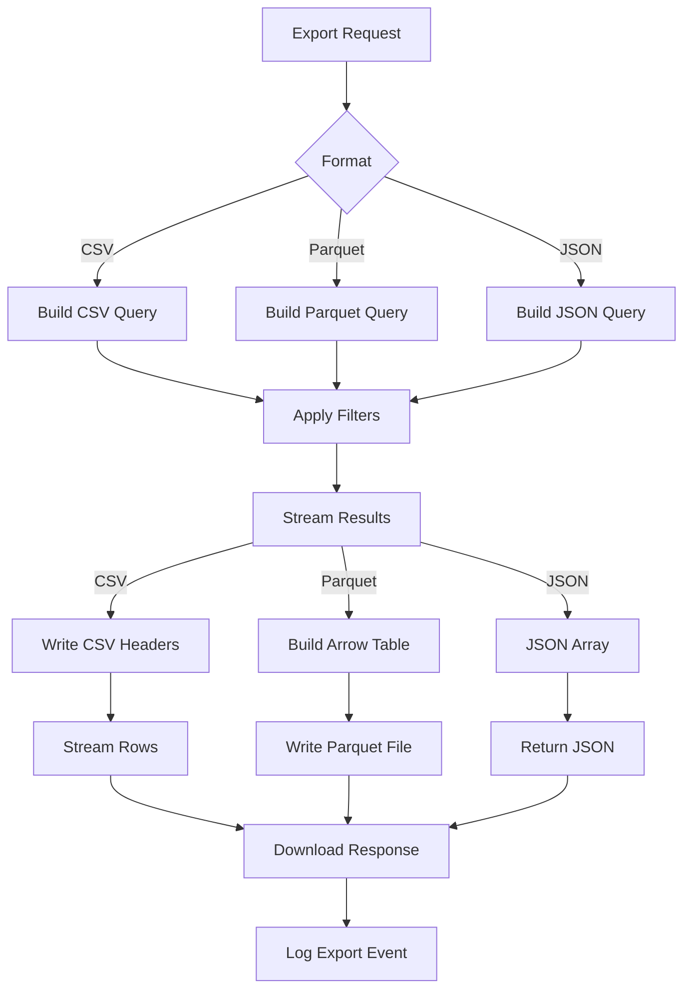
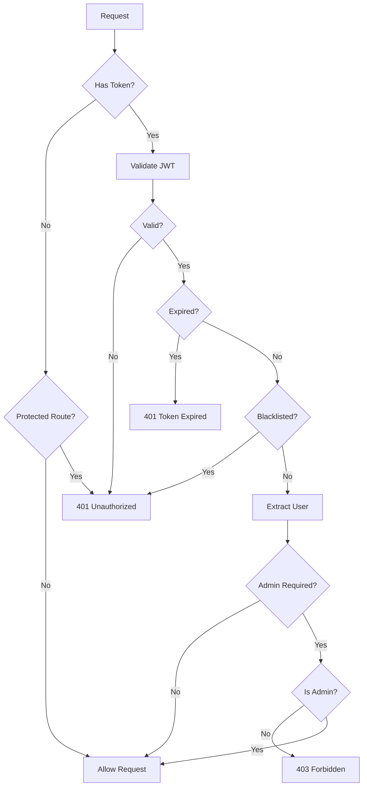

# Data Flow Diagrams

## Overview

This document describes the major data flows in LedgerLoop using Mermaid diagrams.

---

## 1. Transaction Import Flow

### Import Pipeline Details

| Step | Function | File | Output |
|------|----------|------|--------|
| 1. File Upload | POST /imports/csv | routes/imports.py | UploadFile |
| 2. Parse Rows | import_csv_upload() | ingest_csv.py | List[dict] |
| 3. Normalize | normalize_description() | normalization.py | Clean text |
| 4. Parse Amount | parse_amount() | normalization.py | Float |
| 5. Parse Date | parse_date() | normalization.py | ISO date |
| 6. Fingerprint | tx_fingerprint() | dedup.py | SHA1 hash |
| 7. Dedup Check | SELECT by fingerprint | db.py | Exists? |
| 8. AI Enhancement | process_import_run() | ai_import.py | Enhanced tx |
| 9. Insert | INSERT transaction | db.py | Transaction ID |

---

## 2. Categorization Flow

### Categorization Priority

1. **Existing Category** - Already assigned, skip
2. **Merchant Memory** - Learned from previous corrections
3. **Rule Engine** - Regex-based pattern matching
4. **AI Categorization** - LLM-based inference
5. **Fallback** - Mark uncategorized for user review

---

## 3. AI Processing Flow

### AI Provider Fallback Chain

| Priority | Provider | Latency | Cost |
|----------|----------|---------|------|
| 1 | LM Studio (local) | 100-500ms | Free |
| 2 | OpenAI (cloud) | 500-2000ms | Per token |
| 3 | Local Patterns | <10ms | Free |

---

## 4. Transfer Detection Flow

### Transfer Detection Factors

| Factor | Weight | Description |
|--------|--------|-------------|
| Amount Match | 40% | Same magnitude, opposite sign |
| Date Proximity | 30% | Within 3 days default |
| Description Similarity | 20% | Jaccard similarity |
| Account Diversity | 10% | Different accounts |

---

## 5. Recurring Detection Flow

### Recurring Type Classification

| Type | Pattern Examples |
|------|-----------------|
| subscription | Netflix, Spotify, Disney+, software SaaS |
| bill | Utility, internet, phone, rent |
| loan | Mortgage, auto loan, student loan, BNPL |
| credit_card | Credit card payments |
| insurance | Auto, home, life, health insurance |
| income | Payroll, salary, deposits |

---

## 6. P2P Detection Flow

### P2P Provider Patterns

| Provider | Pattern Examples |
|----------|-----------------|
| Zelle | "ZELLE TO", "ZELLE FROM", "ZELLE PAYMENT" |
| Venmo | "VENMO", "VENMO CASHOUT" |
| CashApp | "CASH APP", "SQUARE CASH" |
| PayPal | "PAYPAL", "PP *" |
| Western Union | "WU", "WESTERN UNION" |

---

## 7. Analytics Calculation Flow

---

## 8. Rule Application Flow

### Rule Predicate Types

| Type | Example | Description |
|------|---------|-------------|
| description_contains | "NETFLIX" | Substring match |
| description_regex | "AMZN.*MKTP" | Regex pattern |
| amount_gt | 100.00 | Amount greater than |
| amount_lt | 10.00 | Amount less than |
| merchant_is | "Starbucks" | Exact merchant match |

---

## 9. Export Flow

---

## 10. Authentication Flow

---

*Generated by Claude Code Audit - December 27, 2025*
