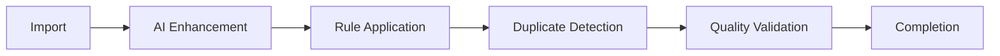

# AI/ML Layer Documentation

## Overview

LedgerLoop implements a comprehensive AI layer with **19 specialized modules** supporting multiple providers (OpenAI, LM Studio, local fallback) for transaction analysis, categorization, and financial intelligence.

---

## Core AI Service

### File: `ai.py` (1,497 lines)

**Purpose:** Central AI orchestration with multi-provider support

### AIConfig Class

```python
@dataclass
class AIConfig:
    provider: str = "auto"  # openai, lmstudio, local, auto
    openai_api_key: Optional[str] = None
    openai_base_url: str = "https://api.openai.com/v1"
    openai_model: str = "gpt-4o-mini"
    lmstudio_base_url: str = "http://localhost:1234/v1"
    lmstudio_model: str = "local-model"
    timeout: int = 30
    connect_timeout: int = 5
    max_retries: int = 2
    retry_min_wait: float = 0.5
    retry_max_wait: float = 10.0
    retry_multiplier: float = 2.0
    retry_jitter: bool = True
    max_concurrency: int = 2
    requests_per_minute: int = 60
    batch_size: int = 5
    confidence_threshold: float = 0.7
    temperature: float = 0.1
    debug: bool = False
```

### Provider Hierarchy

| Priority | Provider | When Used | Latency | Cost |
|----------|----------|-----------|---------|------|
| 1 | LM Studio | Auto mode, local available | 100-500ms | Free |
| 2 | OpenAI | API key configured | 500-2000ms | $0.01/1K tokens |
| 3 | Local | Fallback when AI fails | <10ms | Free |

---

## Primary AI Prompts

### 1. Transaction Categorization Prompt

```
Categorize this bank transaction.

AVAILABLE CATEGORIES: [dynamic list from database]

MERCHANT HINTS:
- AMZN, AMAZON = Shopping
- STARBUCKS, SBUX = Food & Dining
- UBER, LYFT = Transportation
- NETFLIX, SPOTIFY, DISNEY = Entertainment
- [28 total hints]

RULES:
1. Use existing categories only
2. Positive amounts = Income unless transfer
3. ZELLE/VENMO = Transfers, not regular purchases
4. Subscriptions = recurring monthly charges
5. [9 total rules]

Transaction: {description}
Amount: ${amount}

Respond with ONLY valid JSON:
{
  "merchant_name": "Clean merchant name",
  "category": "Category from list",
  "confidence": 0.85,
  "reasoning": "Brief explanation"
}
```

### 2. Merchant Intelligence Prompt

```
Analyze this bank transaction and extract merchant information.

Transaction: {description}
Amount: ${abs(amount):.2f}

Classify the recurring type:
- subscription: Netflix, Spotify, software, memberships
- bill: utilities, internet, phone, insurance premiums
- loan: mortgage, auto loan, student loan, BNPL
- credit_card: credit card payments
- insurance: auto, home, life insurance
- income: payroll, salary, deposits
- unknown: cannot determine

Respond with ONLY valid JSON:
{
  "merchant_name": "clean human-readable merchant name",
  "recurring_type": "one of the types above",
  "sub_category": "specific category like 'streaming', 'fitness'",
  "is_essential": true/false,
  "confidence": 0.0-1.0
}
```

### 3. PDF Extraction Prompt

```
You are a financial document parser. Extract ALL transactions.

For EACH transaction extract:
- date: (YYYY-MM-DD format)
- description: Full transaction text
- amount: negative for debits, positive for credits
- running_balance: if shown
- merchant_name: Cleaned merchant name
- category_hint: e.g., food_dining, shopping, utilities

CRITICAL RULES:
1. Extract EVERY transaction visible
2. Use NEGATIVE amounts for debits/purchases
3. Use POSITIVE amounts for credits/deposits
4. Dates must be YYYY-MM-DD format

Return ONLY valid JSON:
{
  "transactions": [...],
  "metadata": {
    "bank_name": "...",
    "account_last4": "...",
    "statement_period": "...",
    "opening_balance": ...,
    "closing_balance": ...
  },
  "confidence": 0.95
}
```

---

## AI Module Inventory

### Categorization Modules

| Module | Lines | Purpose |
|--------|-------|---------|
| ai_auto_categorization.py | 795 | Confidence-based auto-apply with learning |
| ai_categories.py | ~300 | Category matching and suggestions |
| ai_enhanced_categorization.py | ~400 | Enhanced patterns and merchant recognition |
| ai_smart_categorization.py | ~350 | ML-based with semantic matching |
| ai_category_acceptance.py | ~200 | User acceptance workflow |
| ai_category_schemas.py | ~150 | Category schema definitions |

### Data Processing Modules

| Module | Lines | Purpose |
|--------|-------|---------|
| ai_import.py | ~400 | Import-time enhancement |
| ai_dedup.py | ~300 | Semantic deduplication |
| ai_intelligent_dedup.py | ~250 | Advanced ML dedup |
| ai_data_quality.py | ~350 | Quality scoring and validation |

### Financial Intelligence Modules

| Module | Lines | Purpose |
|--------|-------|---------|
| ai_workflow.py | 510 | Pipeline orchestration |
| ai_transfer_detection.py | ~300 | AI-enhanced transfer matching |
| ai_analytics.py | ~250 | Predictive analytics |
| ai_forecasting.py | ~300 | Cash flow forecasting |
| ai_insights.py | ~250 | Behavioral insights |
| ai_alerts.py | ~200 | Anomaly detection alerts |
| ai_integration.py | ~200 | Provider integration layer |

### Workflow Modules

| Module | Lines | Purpose |
|--------|-------|---------|
| ingest_ai_workflow.py | ~400 | Import workflow |
| insights_ai_workflow.py | ~300 | Insights generation |
| recurring_ai_workflow.py | ~350 | Recurring detection |

### Support Modules

| Module | Lines | Purpose |
|--------|-------|---------|
| merchant_intelligence.py | 697 | Merchant extraction and caching |
| parse/ai_parser.py | ~400 | PDF vision parsing |

---

## Auto-Categorization Engine

### File: `ai_auto_categorization.py`

### Workflow

```python
def process_transaction(tx_id: str) -> CategorizeResult:
    # 1. Check if already categorized
    if has_category(tx_id):
        return skip

    # 2. Try pattern matching first (fast, free)
    pattern_result = enhanced_categorize(description)
    if pattern_result.confidence >= 0.85:
        apply_category(tx_id, pattern_result)
        return pattern_result

    # 3. Fallback to AI if patterns insufficient
    ai_result = ai_categorize(description, amount)
    if ai_result.confidence >= threshold:
        apply_category(tx_id, ai_result)
        learn_pattern(description, ai_result.category)
        return ai_result

    # 4. Return suggestion for user review
    return suggestion(ai_result)
```

### Confidence Thresholds

| Level | Threshold | Action |
|-------|-----------|--------|
| High | >= 0.85 | Auto-apply, learn pattern |
| Medium | 0.60-0.85 | Suggest with priority |
| Low | 0.40-0.60 | Basic suggestion |
| Very Low | < 0.40 | Skip |

### Learning System

When AI returns high-confidence result:

1. Extract merchant pattern from description
2. Store in `merchant_category_mapping` table
3. Future matching uses learned patterns first
4. Reduces AI API costs over time

---

## Merchant Intelligence System

### File: `merchant_intelligence.py`

### Features

- LLM-powered merchant extraction
- Recurring type classification
- Response caching (30-day TTL)
- Hit tracking and statistics

### Cache Structure

```sql
merchant_intelligence_cache (
    description_hash TEXT,     -- SHA256 of description
    clean_merchant_name TEXT,  -- Extracted name
    recurring_type TEXT,       -- subscription/bill/loan/etc
    confidence REAL,           -- 0.0-1.0
    provider TEXT,             -- openai/lmstudio
    expires_at TEXT,           -- Cache expiry
    hit_count INTEGER          -- Usage count
)
```

### Batch Processing

```python
def analyze_batch(descriptions: List[str]) -> List[MerchantInfo]:
    # Single API call for multiple descriptions
    # Returns results in order
    # Per-item latency calculated
```

---

## PDF Vision Parsing

### File: `parse/ai_parser.py`

### Supported Providers

| Provider | Method | Best For |
|----------|--------|----------|
| OpenAI GPT-4o | Native PDF input | Complex layouts |
| OpenAI GPT-4o-mini | Native PDF input | Simple statements |
| LM Studio (Qwen2.5-VL) | Image conversion | Free local parsing |

### Configuration

```python
AIParserConfig:
    max_pages_per_request: 10  # Up to 100 supported
    temperature: 0.1           # Consistent extraction
    max_tokens: 4096
    timeout: 120               # Longer for PDF processing
    retry_count: 2
    prefer_native_pdf: True    # Use native when available
```

### Multi-Page Handling

1. Split PDF into batches of 10 pages
2. Send each batch in parallel (if API supports)
3. Merge results maintaining transaction order
4. Validate against statement totals

---

## Transfer Detection AI

### File: `ai_transfer_detection.py`

### Hybrid Approach

```
1. Heuristic Pre-filter (fast, free)
   - Same amount magnitude
   - Opposite signs
   - Within date window
   - Different accounts

2. AI Analysis (for uncertain pairs)
   - Semantic description similarity
   - Context understanding
   - Confidence scoring

3. Learning from Confirmations
   - User feedback stored
   - Patterns learned for future
```

### Configuration

```python
TransferDetectionConfig:
    max_days: 3               # Date window
    amount_tolerance_pct: 2   # Amount variance
    min_heuristic_score: 0.5  # Pre-filter threshold
    ai_confidence_threshold: 0.75
    high_confidence_threshold: 0.90  # Auto-confirm
    medium_confidence_threshold: 0.70
```

---

## Data Quality System

### File: `ai_data_quality.py`

### Issue Types

| Type | Severity | Description |
|------|----------|-------------|
| MISSING_DATA | HIGH | Required fields empty |
| INVALID_FORMAT | MEDIUM | Malformed data |
| DUPLICATE_ENTRY | HIGH | Exact duplicates |
| OUTLIER_VALUE | MEDIUM | Statistical anomalies |
| ENCODING_ERROR | LOW | Character issues |
| AMOUNT_ANOMALY | HIGH | Suspicious amounts |

### Quality Scoring

```python
def calculate_quality_score(tx: Transaction) -> float:
    score = 1.0

    if not tx.description_norm:
        score -= 0.3  # Missing description

    if not tx.ai_merchant_name:
        score -= 0.2  # No merchant extracted

    if not has_category(tx.id):
        score -= 0.3  # Uncategorized

    if tx.ai_confidence_score and tx.ai_confidence_score < 0.5:
        score -= 0.1  # Low AI confidence

    return max(0.0, score)
```

---

## Workflow Automation

### File: `ai_workflow.py`

### Pipeline Stages



### Configuration

```python
WorkflowConfig:
    enable_ai_enhancement: True
    enable_auto_categorization: True
    enable_duplicate_detection: True
    ai_confidence_threshold: 0.7
    duplicate_confidence_threshold: 0.9
    quality_threshold: 0.6
```

### Quality Report

```json
{
    "workflow_id": "uuid",
    "total_transactions": 150,
    "enhanced_transactions": 142,
    "categorized_transactions": 135,
    "duplicates_found": 3,
    "duplicates_merged": 2,
    "avg_quality_score": 0.87,
    "processing_time_ms": 45000
}
```

---

## Performance Characteristics

### Latency

| Operation | Local | LM Studio | OpenAI |
|-----------|-------|-----------|--------|
| Single categorization | <10ms | 100-500ms | 500-2000ms |
| Batch (50 tx) | N/A | 2-5s | 5-15s |
| PDF page | N/A | 2-10s | 3-8s |
| Merchant extraction | <10ms | 100-300ms | 300-1000ms |

### Rate Limiting

- Default: 60 requests/minute
- Max concurrency: 2 parallel requests
- Batch size: 5 transactions per request
- Exponential backoff on rate limit errors

### Caching

| Cache | TTL | Hit Rate Target |
|-------|-----|-----------------|
| Merchant Intelligence | 30 days | 70%+ |
| Category Cache | 5 minutes | 90%+ |
| AI Response (in-memory) | Session | 50%+ |

---

## Environment Variables

```bash
# Provider Selection
LEDGERLOOP_AI_PROVIDER=auto  # openai, lmstudio, local, auto

# OpenAI Configuration
OPENAI_API_KEY=sk-...
LEDGERLOOP_AI_OPENAI_BASE_URL=https://api.openai.com/v1
LEDGERLOOP_AI_OPENAI_MODEL=gpt-4o-mini

# LM Studio Configuration
LEDGERLOOP_AI_LMSTUDIO_BASE_URL=http://localhost:1234/v1
LEDGERLOOP_AI_LMSTUDIO_MODEL=local-model

# Performance
LEDGERLOOP_AI_TIMEOUT=30
LEDGERLOOP_AI_MAX_RETRIES=2
LEDGERLOOP_AI_MAX_CONCURRENCY=2
LEDGERLOOP_AI_BATCH_SIZE=5

# Thresholds
LEDGERLOOP_AI_CONFIDENCE_THRESHOLD=0.7
LEDGERLOOP_AI_TEMPERATURE=0.1

# Debug
LEDGERLOOP_AI_DEBUG=false
```

---

## Prometheus Metrics

```python
AI_CALLS = Counter('ledgerloop_ai_calls_total', 'Total AI API calls', ['provider', 'operation'])
AI_ERRORS = Counter('ledgerloop_ai_errors_total', 'AI API errors', ['provider', 'error_type'])
AI_LATENCY = Histogram('ledgerloop_ai_latency_seconds', 'AI API latency', ['provider', 'operation'])
AI_RETRIES = Counter('ledgerloop_ai_retries_total', 'AI API retry attempts', ['provider'])
```

---

*Generated by Claude Code Audit - December 27, 2025*
